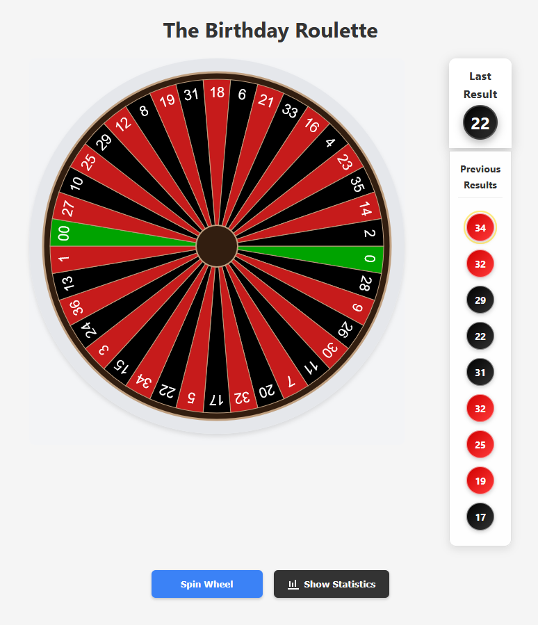

# Roulette Wheel App

A visually appealing and interactive roulette wheel web application built with React and Vite. This project features a realistic roulette wheel simulation with physics-based animations, result tracking, and statistical analysis.



## Features

- Interactive roulette wheel with realistic physics-based animations
- Result tracking with history of previous spins
- Statistics visualization with frequency distribution histogram
- Responsive design that adapts to different screen sizes
- Dark-themed modern interface

## Getting Started

### Prerequisites

This project requires Node.js. The recommended way to install Node.js is using NVM (Node Version Manager).

#### Installing NVM

1. **For Linux/Mac**:

```bash
# Install NVM
curl -o- https://raw.githubusercontent.com/nvm-sh/nvm/v0.39.7/install.sh | bash

# OR using wget
wget -qO- https://raw.githubusercontent.com/nvm-sh/nvm/v0.39.7/install.sh | bash
```

2. **After installation, close and reopen your terminal, then verify NVM is installed**:

```bash
nvm --version
```

3. **Install the latest LTS version of Node.js**:

```bash
nvm install --lts
nvm use --lts
```

4. **Verify Node.js and npm are installed**:

```bash
node --version
npm --version
```

### Installation

```bash
# Clone the repository (if you haven't already)
git clone https://github.com/argearriojas-misc/roulette-wheel-app.git

# Navigate to the project directory
cd roulette-wheel-app

# Install dependencies
npm install
```

### Running the App in Development Mode

```bash
# Start the development server
npm run dev
```

This will start the development server and you can access the app at http://localhost:5173 (or the URL shown in your terminal).

### Building for Production

```bash
# Build the application
npm run build
```

The build process will create a `dist` directory containing optimized files ready for deployment.

### Serving the Production Build

```bash
# Preview the production build locally
npm run preview
```

Alternatively, you can use a simple HTTP server to serve the built files:

```bash
# Install serve globally
npm install -g serve

# Serve the dist directory
serve -s dist
```

## Project Structure

The application is organized into a modular structure:

- **Components**: React components for the UI
  - Wheel-related components (wheel rendering, animation, etc.)
  - Statistics and visualization components
  - Result tracking components
- **Utils**: Utility functions for various features
  - Wheel configuration and data
  - Physics calculations
  - Result tracking and statistics
  - Cookie management for persistence

## Usage

1. **Spin the Wheel**: Click the "Spin" button to start a new spin
2. **View Results**: The most recent result appears in the "Last Result" display
3. **Check History**: Previous results are shown in the history panel
4. **Analyze Statistics**: View the histogram to see the frequency distribution of results

## License

MIT

## Credits

Developed for Argenis' birthday celebration. Enjoy your spins and may luck be on your side!
